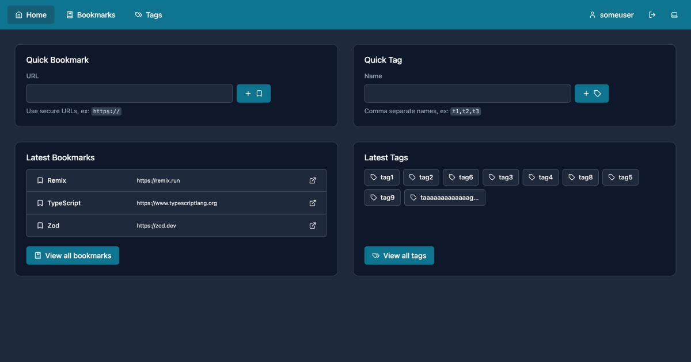

# TagsForDays

TagsForDays extends traditional bookmarking with advanced organization and search capabilities. [https://tagsfordays.fly.dev](https://tagsfordays.fly.dev)

## Roadmap

> <picture>
>   <source media="(prefers-color-scheme: light)" srcset="https://raw.githubusercontent.com/Mqxx/GitHub-Markdown/main/blockquotes/badge/light-theme/warning.svg">
>   
> </picture> 
>
> This project is still in development and all TODOs are subject to change.

### MVP

- TODO: Finalize pagination (cursor vs offset, remove `bookmarks.offset.tsx` route)
- TODO: Finalize tables (construction and types)
- TODO: Add database writes/resets (seeding, testing)
- TODO: Add database "Collection" model (grouped bookmarks, relations, other)
- Complete all TODOs found in codebase

### Other

- TODO: Suggest bookmark title/description/tags (action)
- TODO: Create "Unused Tags" widget (relation count)
- TODO: Create "Popular Tags" widget (relation count x createdAt)
- TODO: Add more E2E and Unit tests
- TODO: Optimize performance
- TODO: Custom tailwindcss config (custom colors, spacing, etc.)
- TODO: Add user multitenancy / profiles
