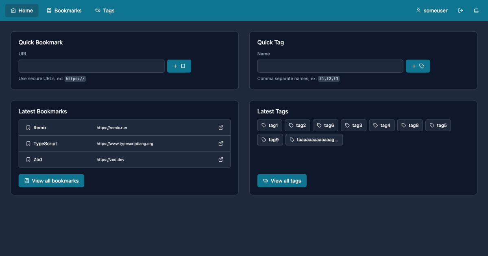

# TagsForDays

TagsForDays extends traditional bookmarking with advanced organization and search capabilities. [https://tagsfordays.fly.dev](https://tagsfordays.fly.dev)

## Roadmap

> <picture>
>   <source media="(prefers-color-scheme: light)" srcset="https://raw.githubusercontent.com/Mqxx/GitHub-Markdown/main/blockquotes/badge/light-theme/warning.svg">
>   
> </picture> 
>
> This project is still in development and all items are subject to change and in no specific order.

### General

- TODO: Add more E2E tests
- TODO: Add more Unit tests
- TODO: Add feature: all/model-filtered data resouce route

### Users

- TODO: Add feature: multitenancy
- TODO: Add feature: profiles

### Tags

- TODO: Add feature: tag colors or other fields
- TODO: Add feature: popular tags (relation count)
- TODO: Add feature: trending tags (relation count x relation dates)
- TODO: Add feature: data resouce route
- TODO: Add more data (seeded, production, etc.)

### Bookmarks

- TODO: Add feature: import/selection
- TODO: Add feature: export/selection (text, csv, json, html)
- TODO: Add feature: bookmark suggest/postfetch-opt-in title/description
- TODO: Add feature: bookmark suggest tags
- TODO: Add feature: bookmark watchtower route (dead links, redirects, etc.)
- TODO: Add more data (seeded, production, etc.)

### Collections

- TODO: Add feature: collection model (grouped bookmarks)
